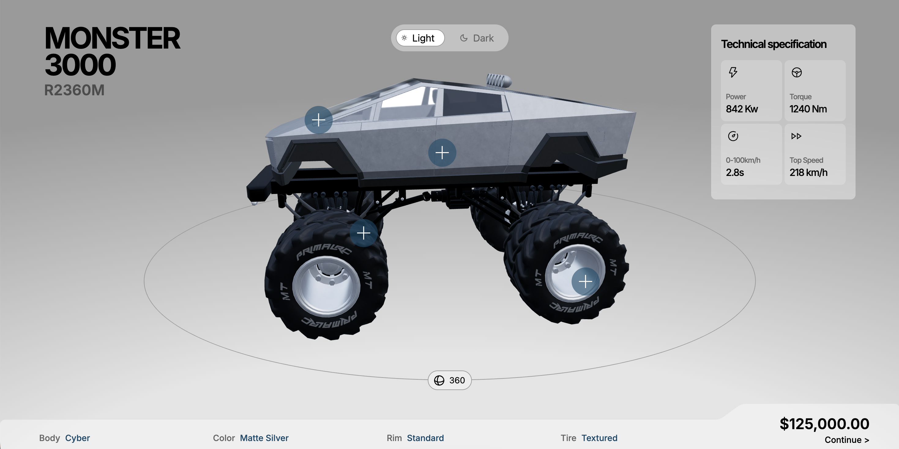
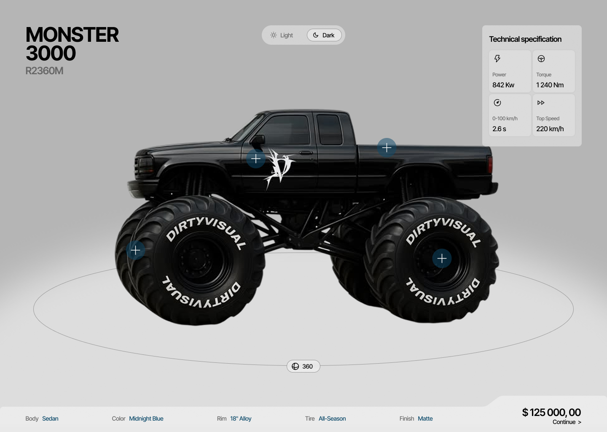
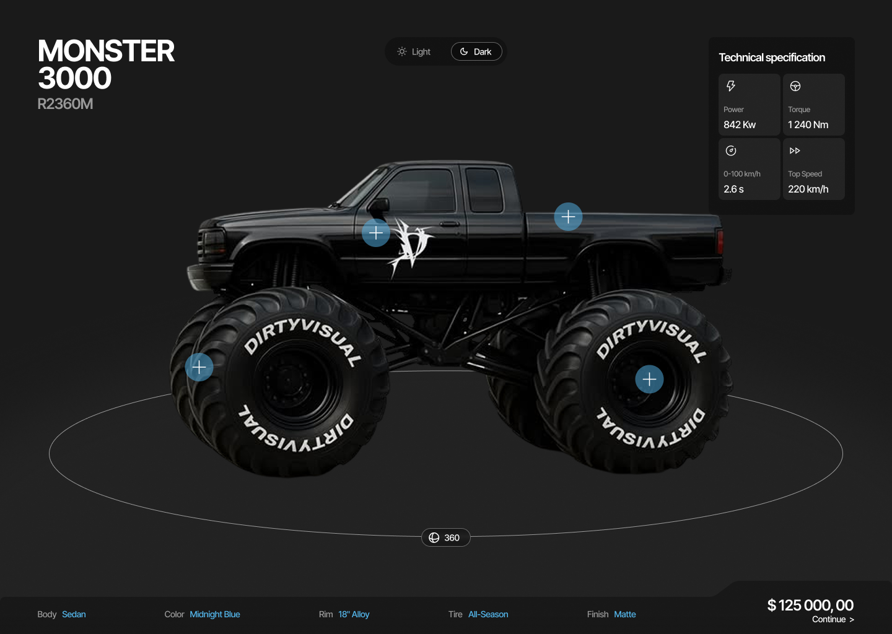
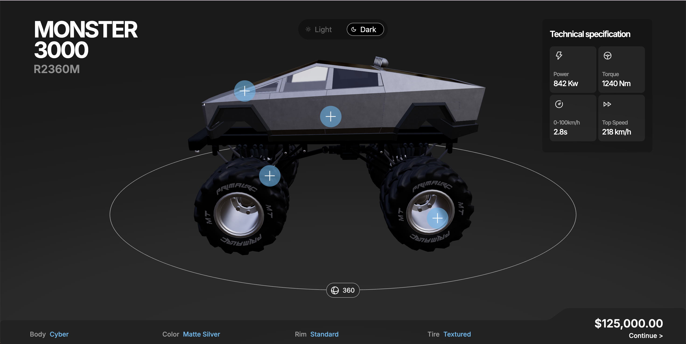

# Monster 3000 — 3D Truck Configurator

An interactive 3D product configurator for a monster truck, built with React and React Three Fiber. Rotate the truck, open hotspots directly on the model, and watch price and specifications update live as you build.

**[→ Live demo](https://monster-conf-nine.vercel.app)**



## About

A cross-disciplinary school project built by three teams, each owning one stage of the pipeline: **CG** modelled and exported the truck, **DD** designed the interface in Figma, and **WU** made this repository and turned both into a working web application.

## Features

- **360° rotation** by dragging anywhere on the canvas, with slow automatic rotation when idle
- **Hotspots anchored in 3D space** that follow the model as it turns and are occluded behind it
- **Four option categories** — chassis, colour, rims and tires — opened from the model itself, fanning out radially from their hotspot
- **Live price and technical specs**, derived from the configuration rather than stored
- **Light and dark themes** that swap the HDRI environment map, so reflections on the model change too — and turn the truck's headlights on in dark mode
- **Accessible controls** — ARIA state on all interactive elements, focus management when menus open, and `prefers-reduced-motion` respected throughout

## Design → Implementation

The Figma designs used a photographed truck as a placeholder while the model was still in production. Layout, type scale, colour system and both themes come directly from the DD team's design.

| | Figma (DD) | Implementation (WU) |
|---|---|---|
| **Light** |  |  |
| **Dark** |  |  |

## Tech stack

**React 19** · **TypeScript 5.9** (strict) · **Vite 8** · **Tailwind CSS 4**

For 3D: **Three.js 0.185** with [**@react-three/fiber**](https://r3f.docs.pmnd.rs) as the React renderer and [**@react-three/drei**](https://drei.docs.pmnd.rs) for `useGLTF`, `Environment` and `Html`.

State is held in [**Zustand**](https://zustand.docs.pmnd.rs), shared between the DOM interface and the 3D scene. Components subscribe to individual fields, so changing a colour doesn't re-render the spec panel.

## Getting started

Requires Node `^20.19` or `>=22.12` (Vite 8) and a browser with WebGL 2.

```bash
git clone https://github.com/mariefarnstrom/configurator.git
cd configurator
npm install
npm run dev
```

| Script | |
|---|---|
| `npm run dev` | Dev server with HMR |
| `npm run build` | Type-check, then build to `dist/` |
| `npm run preview` | Serve the production build locally |
| `npm run lint` | Run ESLint |

Deployed on [Vercel](https://vercel.com), which builds automatically on every push to `dev`.

## Project structure

```
docs/model/     Technical handoff documentation from the CG team
public/         The GLB model and both HDRI environment maps
src/
  components/   Canvas setup and the summary bar shape
  config/       Options, prices, spec values, thumbnails
  scene/        3D scene, hotspots, material logic
    model/      GLB loading and modelContract.ts
  store/        Zustand store and derived-value selectors
  types/        Shared union types for every option
  ui/           The 2D interface layered over the canvas
```

Two files are worth knowing about before changing anything:

[`modelContract.ts`](src/scene/model/modelContract.ts) holds every string that must match the GLB exactly — node names, material names, the model URL. Nothing else refers to the model's internals. The names can't be validated at runtime: `getObjectByName('Rim_1')` just returns `undefined` if it's wrong, and the truck silently loses a wheel. Keeping them in one place means a re-export from Blender is a one-file edit, diffable against the CG documentation.

[`configurator.ts`](src/types/configurator.ts) derives every option type from a `const` array. Because the mappings in the model contract are typed as `Record<ColorId, string>`, adding a colour to the union causes a compile error everywhere it hasn't been handled yet.

## The 3D model

A single GLB exported from Blender, documented by the CG team:

**→ [Monster Truck GLB — Web Developer Documentation](docs/model/wip-2-model-handoff.md)**

glTF 2.0 / GLB, 6.93 MB with textures embedded. 12 nodes, 24 materials, 26 embedded WebP images — and **no cameras, lights or animations**. Three parts of this codebase exist because of that last point: the camera and HDRI lighting in [`TruckCanvas.tsx`](src/components/TruckCanvas.tsx), and the rotation loop in [`RotatingScene.tsx`](src/scene/RotatingScene.tsx).


## Known limitations

- **Desktop only.** The overlay uses a fixed grid that doesn't reflow for narrow screens.
- **Heavy initial load.** The GLB plus both preloaded HDRIs is ~9.7 MB, with no loading indicator. Draco compression and a `<Suspense>` fallback are the obvious next steps.
- **Nothing persists.** A reload returns to the default build; configurations can't be shared.
- **"Continue" is a dead end by design** — it opens a modal explaining the truck can be built but not bought. The modal doesn't trap focus or close on `Escape`.
- **Material lookup is by name.** The CG documentation warns that names in this GLB aren't unique — `plastic_black` and `rim_metal_silver` each appear twice. It works for the four colour materials in use, but isn't safe to extend without checking the material array directly.

## License

[MIT](LICENSE) © 2026 Marie Färnström, Hanna Johansson. The 3D model and interface design are the work of the CG and DD teams.
